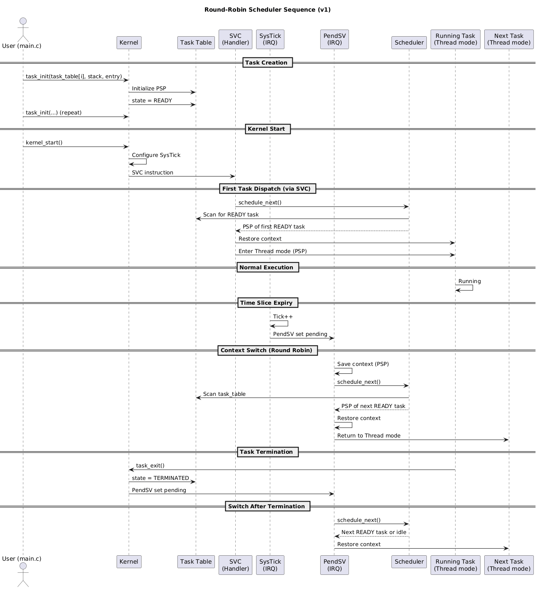

# Minimal Round-Robin Scheduler (Cortex-M)

A **minimal preemptive round-robin scheduler** written from scratch for Cortex-M microcontrollers.

This project focuses on **learning kernel internals** such as context switching, scheduling, and task lifecycle — without HAL or an RTOS.

---

## Features (v1)

- Preemptive round-robin scheduling  
- SysTick-based time slicing  
- Context switching using PendSV  
- Tasks run in Thread mode (PSP)  
- Static task allocation  
- Built-in idle task  
- Task states:
  - READY
  - TERMINATED  
- `task_exit()` support  
> Note  
> In v1, `TERMINATED` is treated as a logical tag only.  
> Strong enforcement and blocking support will be added in later versions.
---

## Basic design

- `task_table[0]` → idle task  
- User tasks start from ID `1`  
- Scheduler always selects a READY task  
- Idle task runs when no user task is READY  

---

## Task model

```c
struct task {
    uint32_t *psp;
    uint8_t  state;
};

enum task_state {
    READY,
    TERMINATED
};
```

---

## How to use

1. Set maximum number of tasks:
```c
#define MAX_TASKS  (1 + number_of_user_tasks)
```

2. Write task functions:
```c
void task_fn(void);
```

3. Initialize tasks:
```c
task_init(&task_table[1], stack_pool[1], task1_fn);
task_init(&task_table[2], stack_pool[2], task2_fn);
```

4. Start the kernel:
```c
kernel_start();
```

---

## Task termination

```c
task_exit();
```

Terminated tasks are skipped by the scheduler.

---

## Examples


- `roundrobin_blink` – multiple tasks blinking LEDs at different rates  
- `roundrobin_exit` – tasks terminate using `task_exit()`  

---


## Planned (v2)

- BLOCKED state  
- Tick-based delay  
- Priority scheduling  

---
## Sequence Diagram 

